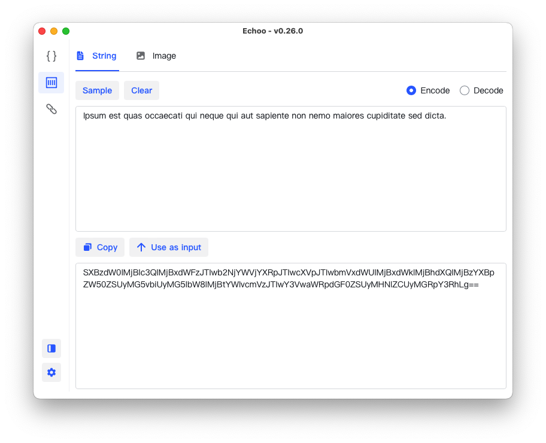

 
<!--  -->

## 💻 Native/Offline Client

Client provides full `offline` features without any remote API calls on your Mac or PC.

### MacOS

#### AppStore

### Windows / Linux

Download them from
the [Github Release](https://github.com/echoo-app/echoo-app/releases) for `Windows` and `Linux`.

## 🌏 Web Browser

**[web.echoo.app](https://web.echoo.app)** hosts the same functionalities of client version.

## 🔑 Privacy and Data Safety

`Echoo.app` clients (web / native) can be completely offline, any of the data you input will **NOT** be collected, including your codes, binary, image etc, anonymouse analysis will only be done only if you opt-in or enabled it ([check source code here](https://github.com/zsmatrix62/echoo.app/blob/4df7e95077809881d5a9f246823001b17d58e8bd/web-src/src/App.tsx#L98)).

## 🎉 Features / Todos

### Encode/Decoder

- [x] Base64 / Image Encoder and Decoder _(v0.22.0)_
- [x] URL Parser, Encoder and Decoder \*(v0.23.0)
- [x] Cron Job Parser _(v0.27.0)_
- [x] URL Encoder/Decoder _(v0.28.0)_

### Validator / Tester

- [ ] JWT Debugger
- [ ] RegExp Tester

### Formatter

- [x] JSON Formatter Validator _(v0.1.0)_
- [ ] SQL Formatter

### Generators

- [ ] UUID/ULID Generator/Decoder
- [ ] Hash Generator

### Converters

- [ ] Number Base Converter
- [x] Unix Time Converter _(v0.28.0)_
- [ ] JSON <- -> YAML

## LICENSE

[AGPL-3.0](https://github.com/zsmatrix62/echoo-app/blob/main/LICENSE)

### Screenshots

<table>
  <tr>
    <td>
     
    </td>
    <td>
      
    </td>
  </tr>
  <tr> <td> </td>
    <td> </td>
  </tr>
</table>

More Screenshots

  <table>
  <tr>
    <td>
      
      </td>
  </tr>
</table>

---

## Love our work?

Please upvote us on:

