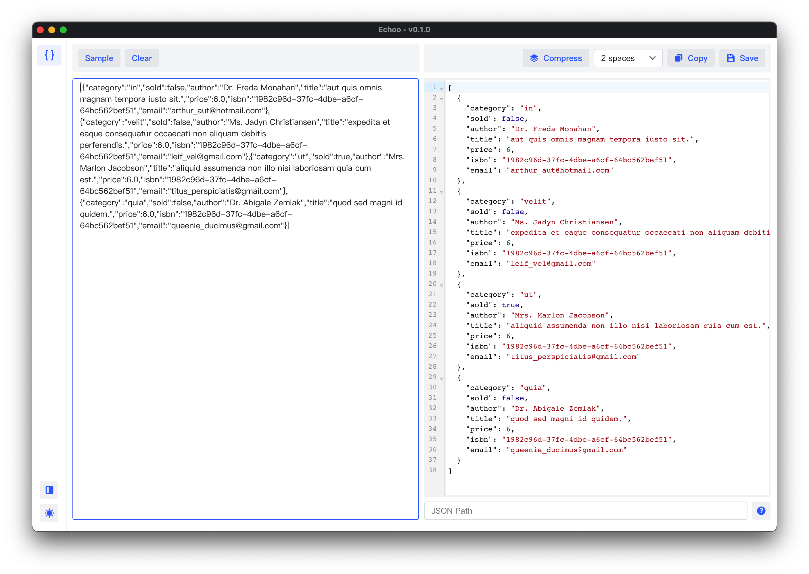

# Echoo

`Echoo` is another collection of tools for developers.

## Web

`Echoo` provides online version of the same tools: [https://echoo.app](https://echoo.app)

## Client

Client version of `Echoo` provides full `offline` features, download them from the release page.

----

-----

## Features

Click link to check screenshots

### Formatters

- [x] [JSON Formatter Validator](document/json-formatter.md)
- [ ] Base64/Base64 Image encoder and decoder
- [ ] URL encoder and decoder
- [ ] URL Parser
- [ ] JWT Debugger
- [ ] RegExp Tester
- [ ] SQL Formatter
- [ ] Cron Job Parser

### Generators

- [ ] UUID/ULID Generator/Decoder
- [ ] Hash Generator

### Converters

- [ ] Number Base Converter
- [ ] Unix Time Converter
- [ ] JSON <- -> YAML